# Project : CAMERA & LIDAR FUSION TO CALCULATE 'TIME TO COLLISION'

### The images below depict the lidar points detected within a 20m range on the vehicle directly in front of the ego vehicle. The first image is the Front View of the lidar points inside the bounding box and the later one is the superposition of the points and the camera image.
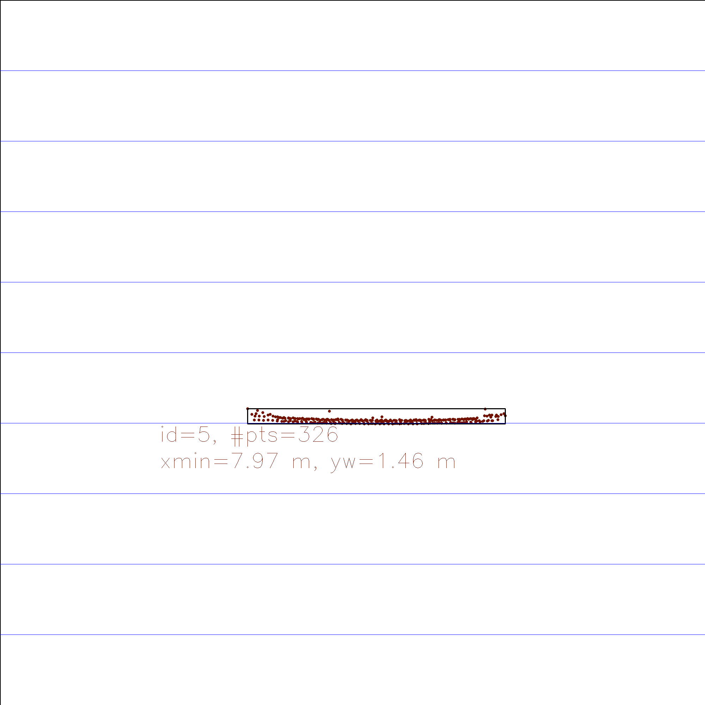
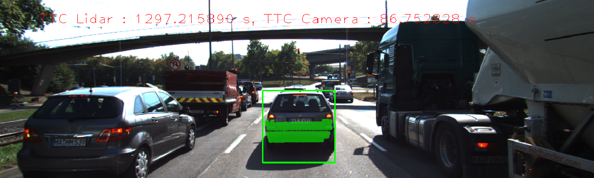

# AIM & RESULTS
## ASSUMPTIONS
1. World size - Focusing on the vehicle ahead, and limiting the points with are with in 20 m from the camera
2. frame rate - 10 ms
3. Deep Learning Algorithm Used: YOLO - more than 80 types of objects can be detected using a single NN in a shorter time with acceptable accuracy

## METHODOLOGY
1. Load Lidar, Camera and YOLO data files
2. Calibrate the lidar and the camera
3. Loop over all images : For each image
    1. add the current image in a ring buffer
    2. detect anf classify object using YOLO 
    3. crop lidar points
    4. cluster lidar points in bounding boxes
    5. detect keypoints, extract descriptors 
    6. if more than one image is present in the buffer
        1. match keypoints with the previous image
        2. match bounding boxes with keypoints
        3. for each bounding box calculate tcc using keypoints and lidar
    7. else continue
4. code ends

## RESULTS FOR RESPECTIVE RUBRIC12
### 1. Match 3D Objects
* INPUT: keypoint matches vector, empty map to store matches bbox, previous and current dataframe
* OUTPUT: map with bbox matches
* ALGORITHM:
    * For each keypoint match pair
        * loop over the list of bounding boxes in the current frame 
        * for each current frame bounding box, if the match pair present inside a previous frame box add +1 to the count variable which keeps a count of the times such are pair was detected
    * For each bounding box in the previous frame
        * find the corresponding current frame bounding box such that they share a maximum number of matched keypoints pairs.
* code for this algorithm is in the *camFusion_Student.cpp* file inside *matchBoundingBoxes* function
* On running the code on default settings, blue denotes previous frame, green denotes current frame
* 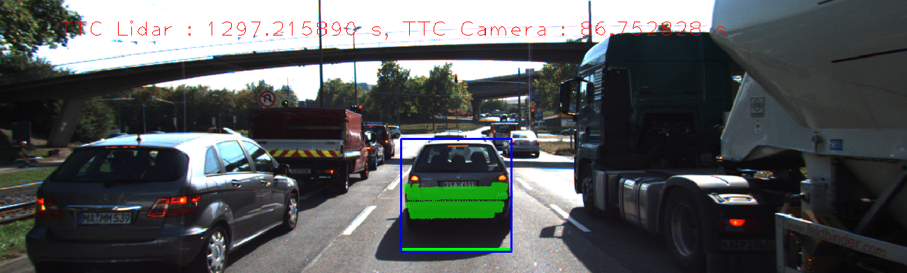

### 2. Compute Lidar-based TTC
* INPUT: frame rate, lidar points of the previous and the current frame
* OUTPUT: TTC
* in the file `output_data.csv` all the TCC data is stored
* ALGORITHM:
    * find the closest lidar point ahead of the camera in both frames
    * to remove outliers, I have calculated the mean and the standard deviation or the X co-ordinates and removed the points which are outside the 3*standard deviation range around the mean X.
    * use the formula `TTC = minXCurr * frameRate / (minXPrev-minXCurr)`

### 3. Associate Keypoint Correspondences with Bounding Boxes
* INPUT: matches, previous and current keypoints and bounding box pair ids
* OUTPUT: ROI specific keypoints and matches are added to the boundingbox data structure
* ALGORITHM:
    * for each match, check if it lies inside the boundingbox
    * find mean distance between each keypoints of two frames, i.e, btw current frame and previous frame
    * outlier matches are then been removed by calculating the a reference `maximum bound = 1.25*mean`

### 4. Compute Camera-based TTC
* INPUT: frame rate, keypoint matches adn keypoints of both the frames
* OUTPUT: TTC
* in the file `output_data.csv` all the TCC data is stored
* ALGORITHM:
    * compute distance ratios between all matched keypoints (I have not used the same method to remove outliers here as used for Lidar points because there only the X co-ordinate was taken into focus to calculate the TTC)
    * calculate the median distance ratio
    * use the formula `TTC = -(1/frameRate) / (1 - medianDistRatio)`
    * abs(), was later added to the above formula after observing that the relative distances increases in two instance. `12-13, 17-18`

### 5. Places where the TTC estimate of the Lidar sensor does not seem plausible. 
* Observation
    * The distance between the vehicles keep decreasing from 7.974 m to 6.814 m.
    * Out of the first 5 observations, the drop in the 4th observation seems faulty. The relative distance between the vehicles is decreasing. The TTC is calculated using constant velocity model, and sudden dips in distances due to acceleration/deceleration might effect the time output.
    * Moreover the point cloud as seen in the below three frames maintains a similar shape.
        * 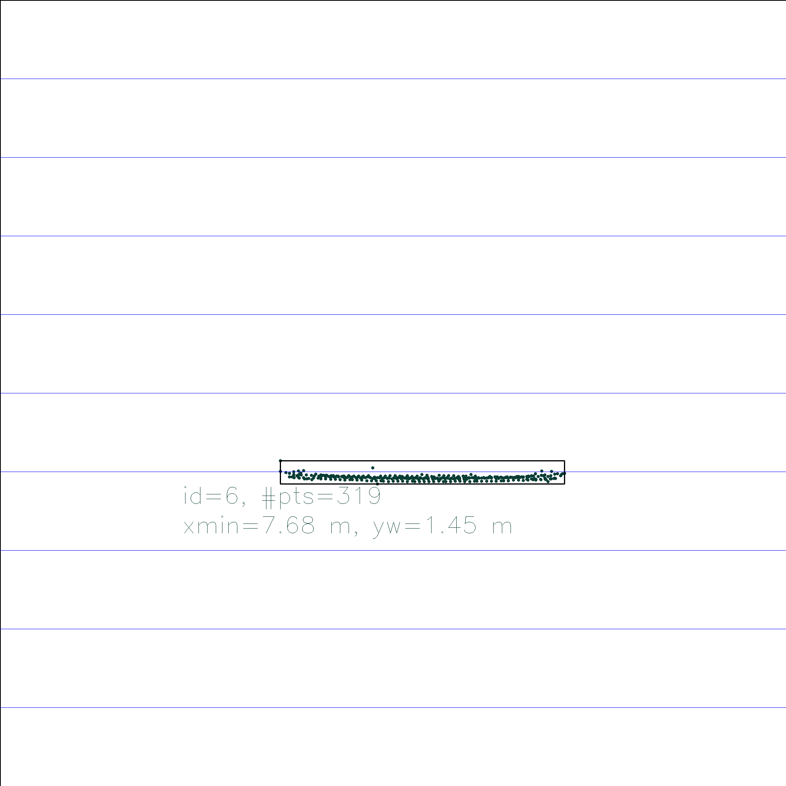
        * 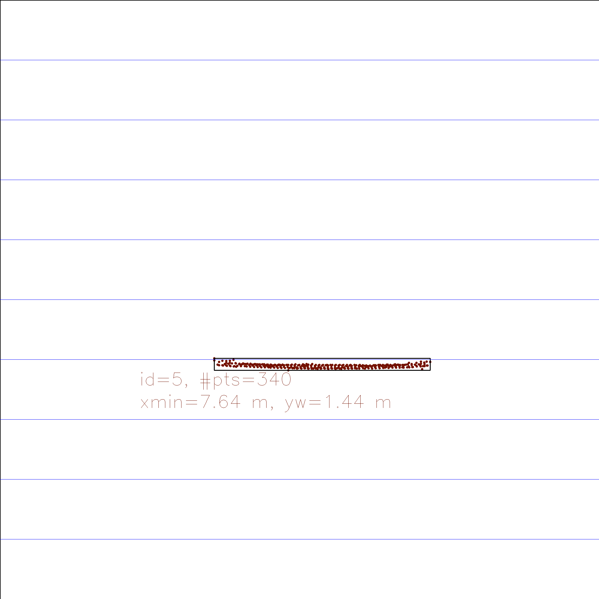
        * 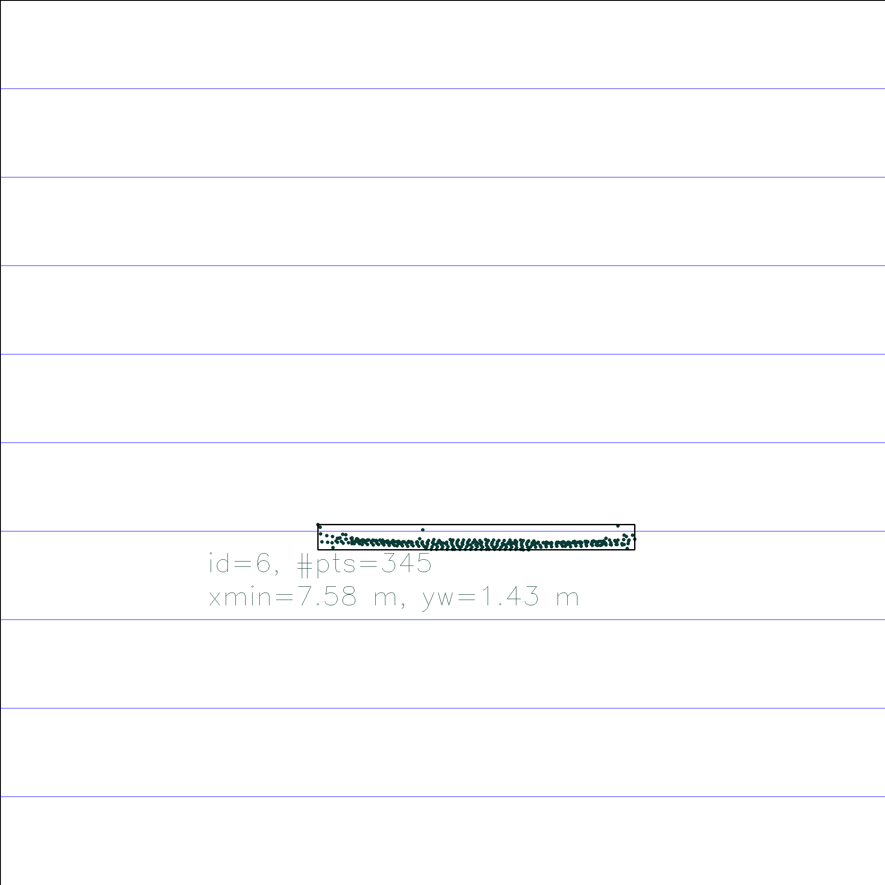
    *  Frames 6-7 where the distances shorten by 0.022 m, but the TTC increases to 34.34 seconds, but clearly we can visually see that the appearance of the preceding vehicle has not changed much between the frames so this is obviously a false reading
    * a short displacement between frames breaks down this assumption quickly.
        *  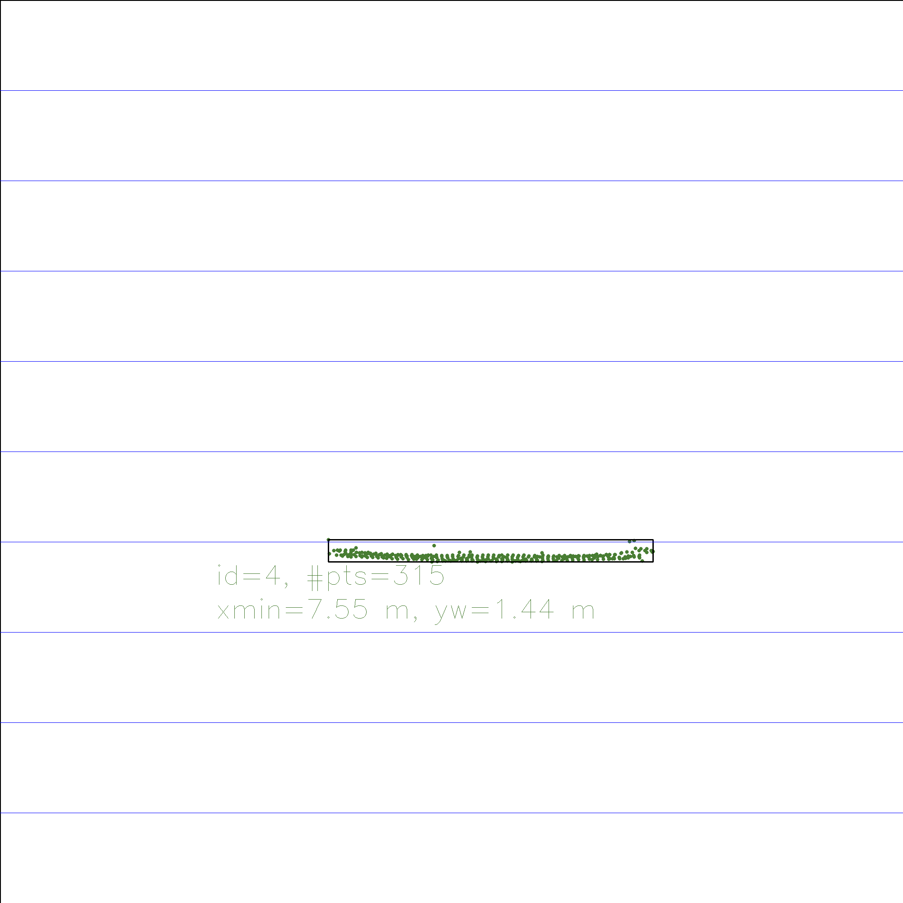
        *  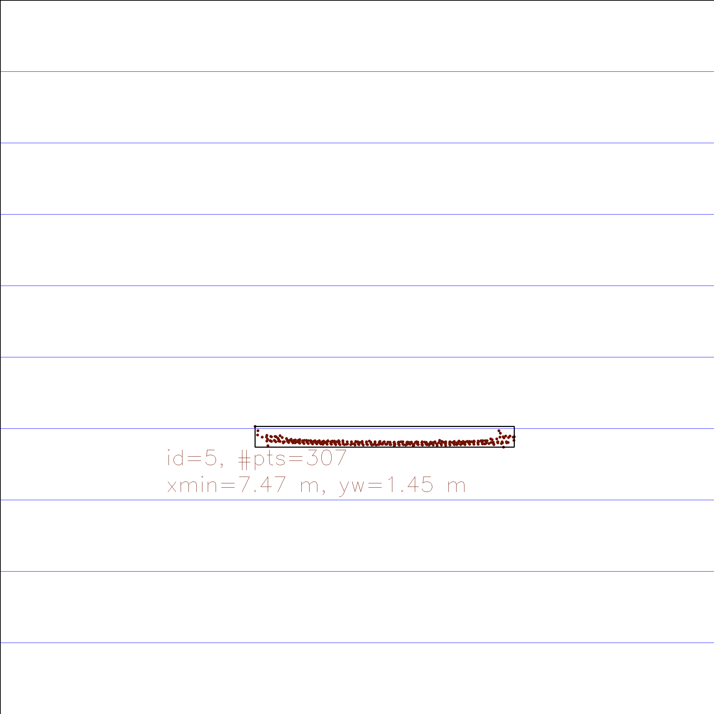
    * Sudden peaks in the change in relative distances from `5-6, 12-13, 17-18` even though the overall spread and shape of the point cloud does not change as seen above
        * These might have cause by the vehicle disturbances
        * Or no sufficient lidar data generation at an instance creating two outliers when the relative distance is smoothly decreasing as seen in the plot below
        *  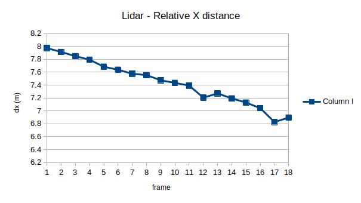
        *  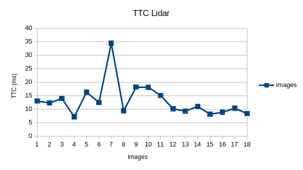

### 6. Ran several detector / descriptor combinations and look at the differences in TTC estimation. 
* METHODS PERFORMING BEST 
    * Graphs comparing TTC
        
        `BRIEF - DESCRIPTOR`
        * 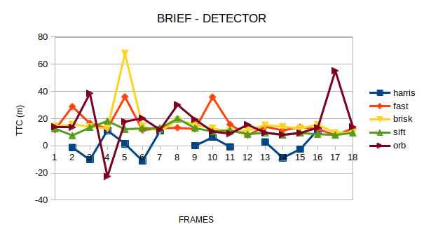
        `FREAK - DESCRIPTOR`
        * 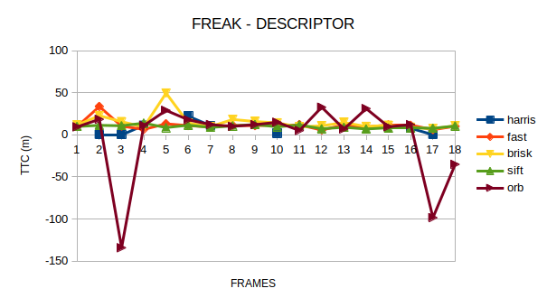
        `SIFT - DESCRIPTOR`
        * 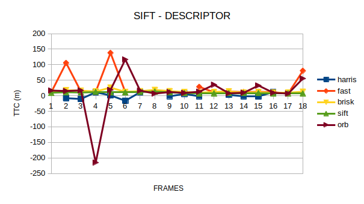
        `ORB - DESCRIPTOR`
        * 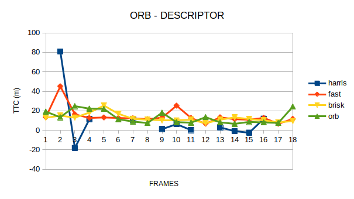
        `AKAZE - DESCRIPTOR`
        * 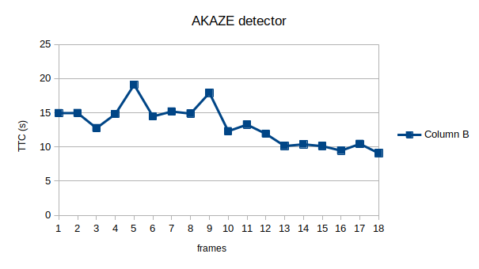

    * The keypoint TTC calculation has several problems depends on what combination of detector and descriptor one uses.
    * In case of HARRIS DETECTOR, the keypoints detected on the preceding vehicle were very less to null. Hence for most of the frames, TTC was not calculated.
    * Additionally, if the distance ratios between pairs of keypoints will be close to 1 because the displacement of the keypoints along the edges of the vehicle will appear to be small. With such a small displacement, most of the pairs of ratios will be 1, thus when we calculate the TTC, we will get infinity as the answer.
    * In contrast to that for cases where several keypoints were calculated, the estimated gace plausible results without any extreme peaks. Such combinations include
        * SIFT - BRIEF
        * BRISK - FREAK
        * SIFT - FREAK
        * BRISK - SIFT
        * SIFT - SIFT
        * ORB - ORB
        * BRISK - ORB
        * AKAZE - AKAZE  

* Camera-based TTC estimation is way off. - Harris less keypoints
    * pictorial representation of various detectors, which clearly show how HARRIS detector has the least keypoints detected on the preceding vehicle
    `HARRIS`
    * 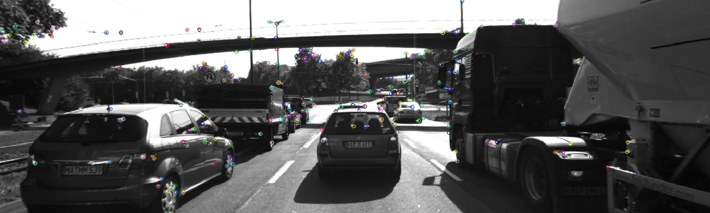
    `BRISK`
    * 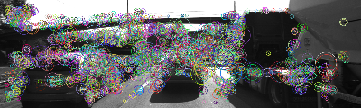
    `FAST`
    * 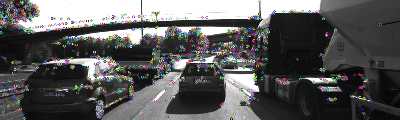
    `SIFT`
    * 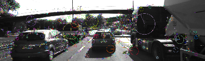
    `ORB`
    * 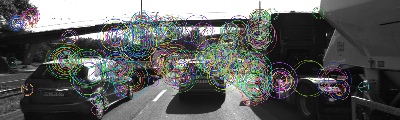


## BUILDING THE PROJECT
```
# download openCV 4.2.0 alongwith the free modules and opencv_contrib
cd workspace/dat/yolo
wget https://pjreddie.com/media/files/yolov3.weights
cd workspace
mkdir build
cd build
cmake ..
make 

# the code have a maximum of six input arguments
# `executable` `detector` `descriptor` `matcher` `selector`
./3D_object_tracking HARRIS FREAK MAT_BF SEL_NN
```
The command-line arguments can in varied configurations which include

- `detectorType`: The type of detector to use - one of `HARRIS`, `FAST`, `BRISK`, `AKAZE`, `SIFT`, `ORB`
- `descriptorType`: The type of descriptor to use - one of `BRIEF`, `ORB`, `FREAK`, `AKAZE`, `SIFT`
- `matcherType`: Matching algorithm - one of `MAT_BF`, `MAT_FLANN`.
- `selectorType`: Keypoint selection method - one of `SEL_NN`, `SEL_KNN`

NOTES:
1. AKAZE detector works only with AKAZE descriptor
2. SIFT detector cannot be paired with ORB descriptor, it gives out `out of memory` error
3. default settings are -> `SHITOMASI` `BRIEF` `MAT_BF` `SEL_NN`
4. manually change bVis to visualize various images, by default its set to false.
5. We are always focusing on the vehicle excatly in front, so the peypoints and the lidar points are cropped accordingly.